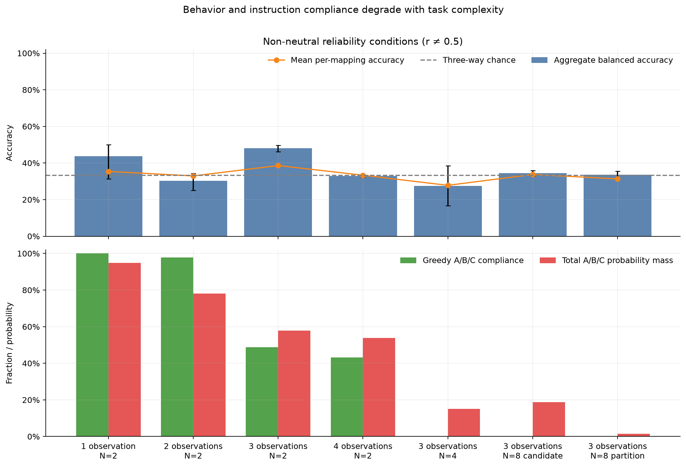
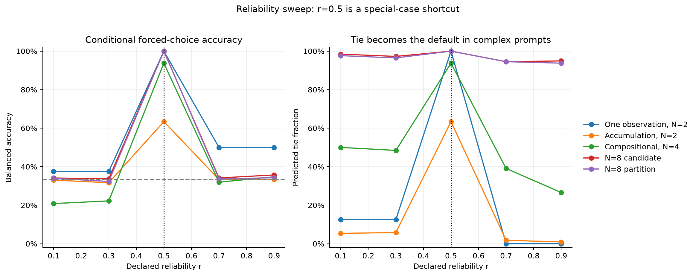
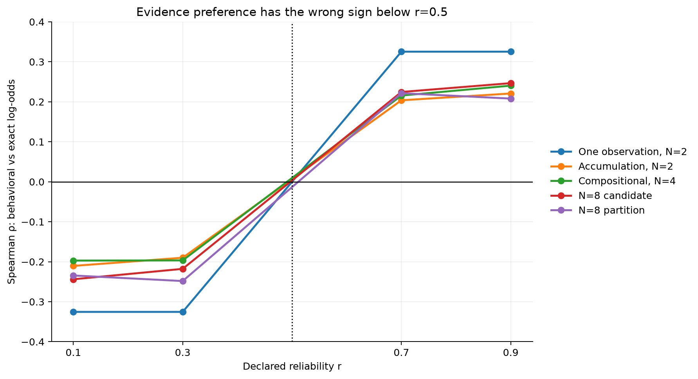
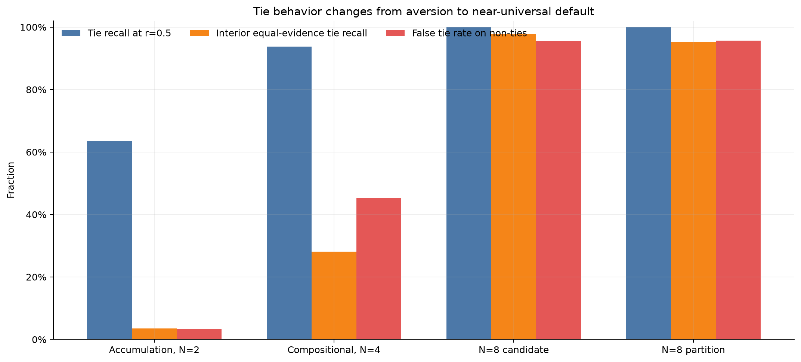
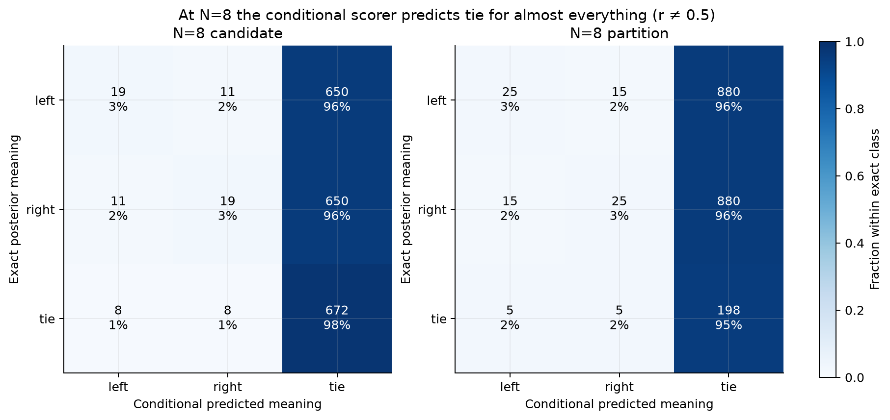
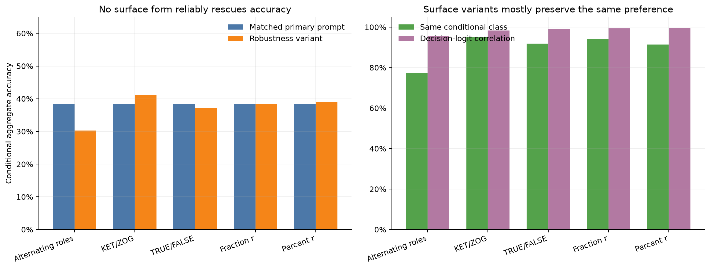
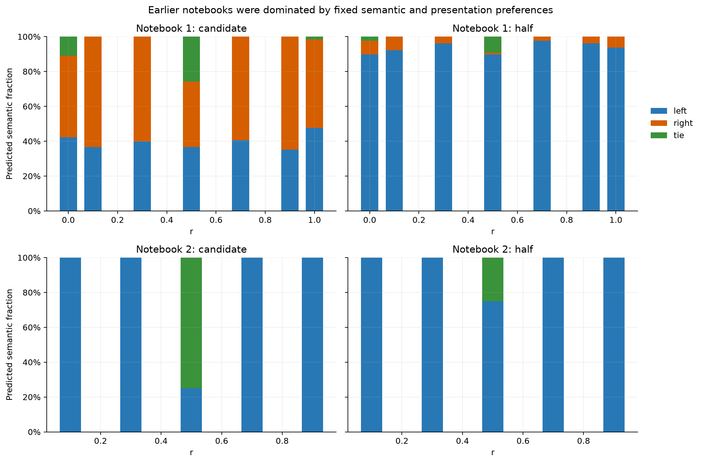

# Qwen3.5-4B posterior-tracking experiment: behavioral analysis

Analysis date: 2026-08-27. This report analyzes the completed outputs from notebooks 1–3. The
main controlled experiment used Qwen3.5-4B with thinking disabled. No model calls were rerun.

## Executive conclusion

The results do **not** provide behavioral evidence that Qwen3.5-4B is computing the intended
Bayesian posterior in this game. They support a narrower conclusion:

- Qwen can compare two explicitly supplied weights: the arithmetic elicitation control is 6/6
  correct under every A/B/C mapping.
- It recognizes the verbal special case that a channel with `r=0.5` is uninformative, especially in
  the longer prompts.
- In the actual evidence task it does not reliably apply answer polarity or invert evidence when
  `r` crosses 0.5. Paired examples at `r` and `1-r` almost never reverse its preference, even though
  the exact posterior must reverse.
- At small scale, valid A/B/C answers are driven mainly by which candidate the question mentions.
  At larger scale, a second failure appears: Qwen usually begins an explanation with `To` instead
  of producing A/B/C. The conditional three-label score then defaults to `tie` for almost every
  case. These are distinct reasoning and elicitation failures.

Thus the strong `r=0.5` scores and some apparently above-chance aggregate scores should not be read
as posterior tracking. The most diagnostic interventions—the sign of `r`, YES versus NO, and
evidence accumulation—fail.

## Data and measurement

The primary controlled arm contains 8,080 aggregate decisions. Each aggregate decision averages
the label probabilities over all six mappings between semantic answers (`left`, `right`, `tie`) and
tokens A/B/C. A further 1,850 decisions test prompt-surface variants. There are also six direct
elicitation controls, 1,792 decisions from notebook 1, and 80 from notebook 2.

Four measurements must be kept separate:

1. **Aggregate balanced accuracy** is computed after averaging the six semantic probability
   distributions. It controls first-order A/B/C label preference.
2. **Mean per-mapping accuracy** asks how often each individual A/B/C rendering is correct. A large
   gap from aggregate accuracy indicates label sensitivity.
3. **Greedy compliance** asks whether the unrestricted next token was actually A, B, or C.
4. **A/B/C probability mass** asks how much ordinary next-token probability the three labels
   receive. Conditional semantic probabilities are hard to interpret when this mass is low.

Reported uncertainty in the first figure is a 2,000-resample percentile cluster bootstrap over
independently generated schedules/worlds, not over the six label mappings.

## 1. Capacity control succeeds, but the minimal evidence control fails

The explicit-weight control is perfect: accuracy, per-mapping accuracy, and greedy compliance are
all 100%. Qwen can therefore understand the comparison response format and map semantic answers to
A/B/C when the posterior weights are already supplied.

The one-observation `N=2` task is the cleanest test of actual Bayesian use. Outside `r=0.5`, its
balanced accuracy is 43.8% (95% cluster interval 31.3–50.0%), mean per-mapping accuracy is 35.4%,
greedy compliance is 100%, and A/B/C contains 94.9% of next-token mass. This cannot be dismissed as
an output-format failure: the model gives valid labels confidently, but gives the wrong semantic
answer.

More specifically, it tends to favor the candidate named in the membership question after both
YES and NO. This works for some high-reliability YES cases and fails for the matched low-reliability
cases. It also misses the fact that a high-reliability NO is evidence *against* membership. The
earliest failure is therefore applying the likelihood, not accumulating many likelihoods.

## 2. The declared reliability does not reverse the model's evidence preference

For a binary symmetric channel, replacing `r` by `1-r` negates every evidence log-likelihood ratio.
For each identical example and probe, the exact left/right log-odds must therefore change sign. This
paired intervention is much more diagnostic than raw accuracy.

| Task | Matched pairs | Behavioral sign reversal | Left/right class flip | Same predicted class |
|---|---:|---:|---:|---:|
| One observation, N=2 | 32 | 0.0% | 0.0% | 87.5% |
| Accumulation, N=2 | 896 | 0.0% | 0.0% | 95.8% |
| Compositional, N=4 | 256 | 0.0% | 0.0% | 83.6% |
| N=8 candidate probes | 1,024 | 6.4% | 0.0% | 96.1% |

The complete absence of left/right class flips is the central negative result. The model's
preference has nearly the same direction on either side of `r=0.5`. Consequently, rank correlation
with exact log-odds is negative below 0.5 (roughly -0.19 to -0.33) and positive above 0.5 (roughly
+0.20 to +0.33). That pattern is exactly what one expects if a fixed surface-evidence preference is
being compared against a target whose sign flips, not if the model applies the declared channel.

## 3. Evidence accumulation is not demonstrated

For non-neutral reliability values, balanced accuracy across the complexity ladder is:

| Evidence task | Decisions | Balanced accuracy | Mean per-mapping accuracy | Greedy A/B/C | A/B/C mass |
|---|---:|---:|---:|---:|---:|
| 1 observation, N=2 | 64 | 43.8% | 35.4% | 100.0% | 94.9% |
| 2 observations, N=2 | 256 | 30.2% | 32.9% | 97.8% | 78.0% |
| 3 observations, N=2 | 512 | 48.0% | 38.6% | 48.8% | 57.9% |
| 4 observations, N=2 | 1,024 | 32.8% | 33.3% | 43.2% | 53.8% |
| 3 observations, N=4 | 512 | 27.4% | 27.8% | 0.0% | 15.2% |
| 3 observations, N=8 candidate | 2,048 | 34.4% | 33.7% | 0.0% | 18.7% |
| 3 observations, N=8 partition | 2,048 | 33.5% | 31.3% | 0.0% | 1.5% |

Three-way chance balanced accuracy is 33.3%. The non-monotonic 48.0% at three observations does not
rescue a Bayesian account: the same conditions still fail the paired reliability inversion, and
different label mappings agree poorly. At high reliability, simple match-counting would be exact
for the controlled `N=2` schedules, but Qwen remains around one-third balanced accuracy. It is not
consistently summing even the evidence statistic that the exact posterior uses.

## 4. “Tie” changes from an avoided answer to a length-induced default

The experiment distinguishes two kinds of normative tie:

- **Uniform ties:** `r=0.5`, where all secrets have equal posterior weight.
- **Interior equal-evidence ties:** `r != 0.5`, where the two probed alternatives receive equal
  accumulated evidence.

| Task | Recall on `r=0.5` ties | Recall on interior ties | False ties on non-ties |
|---|---:|---:|---:|
| Accumulation, N=2 | 63.4% | 3.5% | 3.4% |
| Compositional, N=4 | 93.8% | 28.1% | 45.3% |
| N=8 candidate | 100.0% | 97.7% | 95.6% |
| N=8 partition | 100.0% | 95.2% | 95.7% |

This reconciles the earlier observation that Qwen avoided ties with the newer runs. In short tasks,
it genuinely avoids evidence-derived ties. In long tasks, “tie” is selected by the renormalized
A/B/C score because the real greedy continuation is outside the choice set. At `N=8`, the first
greedy token is `To` in 30,716 of 30,720 label-mapped prompts. A/B/C mass falls to 18.7% for
candidate probes and only 1.5% for partition probes. The near-perfect tie recall is therefore paired
with a roughly 96% false-tie rate and is not evidence of posterior equality computation.

## 5. Surface-form controls do not rescue the behavior

Changing YES/NO to TRUE/FALSE or KET/ZOG, expressing reliability as a fraction or percentage, and
using alternating conversation roles leaves the conditional preference largely unchanged. Matched
decision-logit correlations with the primary prompt are 0.956–0.995; conditional class agreement is
77.3–95.1%. No variant reliably improves accuracy. KET/ZOG is the largest apparent increase
(38.4% to 41.1% on its matched subset), but greedy A/B/C compliance is still only 27.3%, so this is
not a robust recovery of the intended computation.

These controls reduce the likelihood that YES/NO semantics or decimal parsing alone explains the
failure. They do not eliminate shared prompt-template or instruction-following confounds.

## 6. What the earlier notebooks were measuring

Notebook 1 was dominated by fixed presentation preferences. For half-versus-half probes it chose
the displayed left half in about 90–98% of cases at every reliability. Candidate probes had a
weaker but persistent right preference. Notebook 2 then chose left for virtually every non-neutral
case in both probe types. These response distributions explain why raw accuracy in the early runs
was hard to interpret: accuracy mixed posterior reasoning with candidate identity, probe order, and
choice-position bias.

Notebook 3 improves this substantially by reversing probe orientation and averaging all six label
mappings. That removes the most obvious fixed left/right and A/B/C biases from the aggregate metric,
but it exposes rather than fixes the deeper problem: the resulting semantic preference still does
not respond correctly to reliability. Also, forward/reverse aggregate symmetry should not be
treated as an independent robustness result—the reversed probe and permuted label mappings produce
the same multiset of six prompts.

## Interpretation and limits

The strongest warranted claim is: **under this prompt and disabled-thinking decoding regime,
Qwen3.5-4B does not behaviorally implement the noisy-channel posterior.** The data identify two
bottlenecks: likelihood semantics at minimal scale and answer elicitation at larger scale. They do
not establish that no posterior-related information exists internally, nor that Qwen could not solve
the task under a different elicitation regime.

The optional thinking-enabled upper-bound arm was not run, so the experiment currently separates
format compliance from forced-choice scoring but not immediate response from deliberative
capability. The `N=8` bank also samples schedules uniformly by design; natural prior-predictive
reweighting changes non-neutral candidate accuracy only modestly (about 30–33%) and partition
accuracy remains very low (about 7–13%), so the conclusion is not an artifact of the controlled
schedule distribution.

## Recommended next behavioral tests

1. Stop scaling task complexity until the one-observation `N=2` gate is passed. Use four explicit
   cells: YES/NO crossed with `r=0.9/0.1`, and require the expected reversal in paired log-odds.
2. Remove A/B/C entirely for that gate. Ask directly for the more likely candidate, then separately
   ask for numeric posterior odds. This distinguishes likelihood understanding from label mapping.
3. Run the existing thinking-enabled arm as a capability upper bound and score the parsed final
   answer, not the first-token A/B/C restriction.
4. Add a prompt control that explicitly states “when `r<0.5`, invert the received answer.” If this
   rescues the paired reversal, the deficit is instruction retrieval; if not, it is closer to failed
   application of the rule.
5. For larger tasks, require a structured evidence table or a final-answer delimiter. Do not
   interpret conditional A/B/C probabilities while ordinary A/B/C mass is near zero.

Mechanistic follow-up should remain deferred until at least one behavioral condition shows reliable
reliability inversion and evidence accumulation. The relevant literature and how it informed the
counterbalancing and stopping criterion are recorded in [`CITATIONS.md`](../../CITATIONS.md).

Machine-readable values for every figure are in [`analysis_summary.json`](analysis_summary.json),
and the figures can be reproduced with
[`scripts/analyze_posterior_results.py`](../../scripts/analyze_posterior_results.py).
